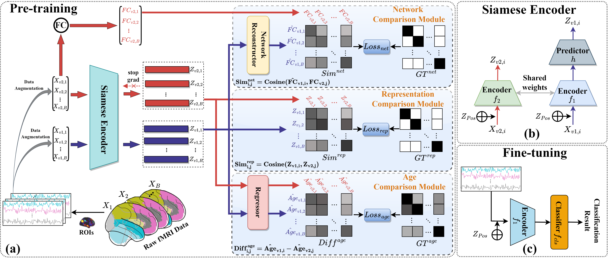

# MSC-Net: Representations of human brain function through multi-sample comparisons for fMRI-based neuropsychiatric disorder classifications

<p align="center">
  
</p>

## Pre-training

Here is an example that pretrains MSC-Net base on ADHD-200 with 4 GPUs. Please see [scripts/pretrain.sh](scripts/pretrain.sh) for complete script.
```bash
dataname='ADHD'
OUTPUT_DIR="/your/output/path/"
batch_size=8

# ============================ pretraining ============================
OMP_NUM_THREADS=1 CUDA_VISIBLE_DEVICES="0,1,2,3" python -m torch.distributed.run \
  --nproc_per_node=4 \
  tools/run_pretraining.py \
  --output_dir ${OUTPUT_DIR} \
  --model model-to-use \
  --batch_size ${batch_size} --lr 5e-4 --warmup_epochs 2 --epochs 800 \
  --clip_grad 7.0 --layer_scale_init_value 0.1 \
  --drop_path 0.1 \
  --mask_generator random \
  --decoder_layer_scale_init_value 0.1 \
  --no_auto_resume \
  --save_ckpt_freq 100 \
  --exp_name 'pretrain' \
  --input_size 264 \
  --ratio_mask_patches 0.5 \
  --predictor_depth 2 \
  --decoder_depth 2 \
  --align_loss_weight 2 \
  --dataset ${dataname}
```
- `--model`: Pre-train the model with different kernel size. Please see [models/modeling_msc.py](models/modeling_msc.py) for more detail.
- `--ratio_mask_patches`: percentage of the time points of the input time-series need be masked. 
- `--batch_size`: batch size per GPU.
- `--lr`: learning rate.
- `--warmup_epochs`: learning rate warmup epochs. Warm up [20, 50, 80] epochs for [200, 500, 800] pretrain epochs respectively.
- `--epochs`: total pretraining epochs.
- `--clip_grad`: clip gradient norm.
- `--drop_path`: stochastic depth rate.
- `--layer_scale_init_value`: 0.1 for base, 1e-5 for large, set 0 to disable layerscale. We set `--decoder_layer_scale_init_value` the same as this.
- `--regressor_depth`: length of the regressor.
- `--decoder_depth`: length of the decoder.

- ## Fine-Tuning

Here is an example that pretrains MSC-Net base on ADHD-200 with 4 GPUs. Please see [scripts/pretrain.sh](scripts/pretrain.sh) for complete script.
```bash
dataname=('ADHD')
MODEL_PATH=(
    your/pre-trained/model/path/
)

for dataname in "${dataname[@]}"; do
  experiment_name=$(basename "$(dirname "$MODEL_PATH")")

  OUTPUT_DIR= your/output/path

  for i in {1..5}; do
    echo "Run $i th project with model: $experiment_name"
    OMP_NUM_THREADS=1 CUDA_VISIBLE_DEVICES="0,1,2,3" python -m torch.distributed.run \
        --nproc_per_node=4 \
        tools/run_class_finetuning.py \
        --model model-to-use \
        --finetune $MODEL_PATH \
        --nb_classes 2 \
        --output_dir $OUTPUT_DIR \
        --batch_size 64 \
        --lr 5e-5 --update_freq 1 \
        --warmup_epochs 5 --epochs 80 --layer_decay 0.65 --drop_path 0.1 \
        --weight_decay 0.05 \
        --sin_pos_emb \
        --dist_eval \
        --dataset ${dataname} \
        --no_auto_resume \
        --KFolds 5 \
        --seed 3407 \
        --ith $i
  done
done
```
- `--model`: Fine-tune the model with different kernel size. Please see [models/modeling_finetune.py](models/modeling_finetune.py) for more detail.
